## Project Video Link:
https://youtu.be/EtQGa49pLYc

## Basic Experiments
To start, I loaded up the arena, creating ‘arena_envt.py’ which was a base for the creature to spawn on when the ‘test_ga.py’ code was run.

Then instead of rewarding distance travelled as shown in the lectures, the strategy I decided to implement was to get the euclidean distance in space for the summit and the robot, and the closer the robots distance was to the top of the mountain as a vector, the higher the fitness was. This can be found in creature.py under: def get_distance_to_peak(self).

I was thinking of using a fitness where it rewarded the height separately to the centre point in 2d space, but from the lectures it was discussed that the robots could ‘cheat’ this and fly away in order to gain an advantage, so I opted for a different tactic, measuring the distance with euclidean coordinates. This was created inside the ‘Creature’ class.

## BE - Iteration 1

  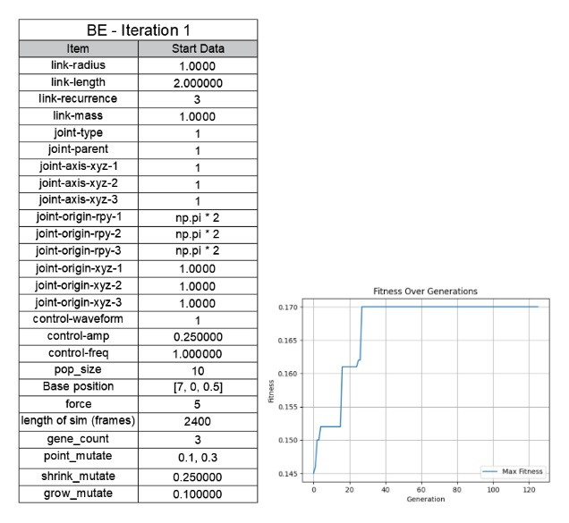

This original design was to use the current sizings from the lectures to see what it created. I noticed it plateaued quite early so I stopped the simulation to assess the situation.
I realised it was getting stuck in the floor which made it ‘bounce’ and cheat the movement, which meant it was not evolving further so I needed to alter the settings. 

  

The creatures also looked quite basic so I thought to increase the ‘grow_mutate’ to create more variants.

  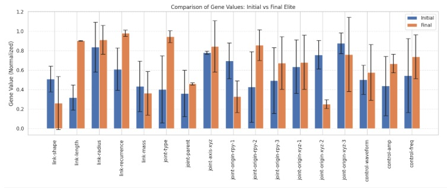

With this graph that shows the difference from the initial to the last elite, it shows that link-length and recurrence has increased a lot, and the joint origins 1 and 2 have switched around in values. It has also got stronger with control-amp and control-freq

## BE - Iteration 2

  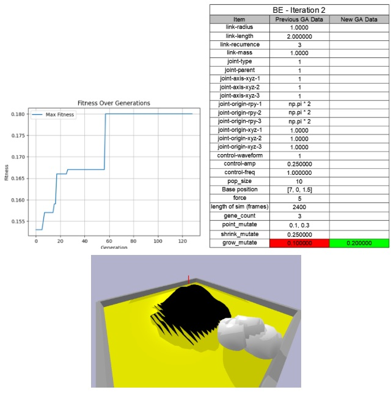

For this one the robot had gotten to the point where it was so big it was using the wall to get closer to the mountain which was bending the rules a bit, and stopped it from evolving further. This made me begin to think when I moved onto the encoding scheme that I wanted to edit the sizings first to shrink it down slightly so that this stopped happening.

  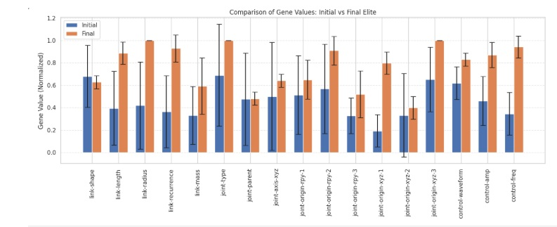

This graph shows quite a large change across the board for the first elites to the last elites, with almost everything increasing in general.
BE - Iteration 3
For this one I let the process happen for 1000 simulations to see if any further developments were able to occur down the line. I reduced the ‘grow_mutate’ and ‘point_mutate; slightly so it couldn’t use the edge of the area to spring off, and also increased the population size to ‘50’ instead of the previous ‘10’ to give more options for each evolution round.

  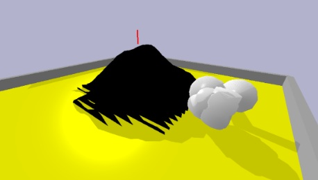

 
It was making progress and got to the edge of the mountain, but I felt like I needed to try some different forms by editing the coding scheme to see if any other creature designs worked better.

  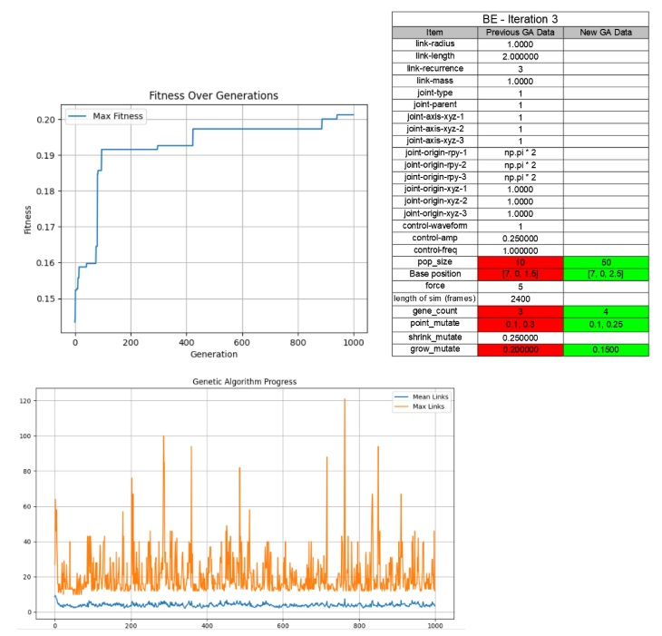

This shows that the majority of links are between 0 and 5, however this can extend all the way past 120 links.

  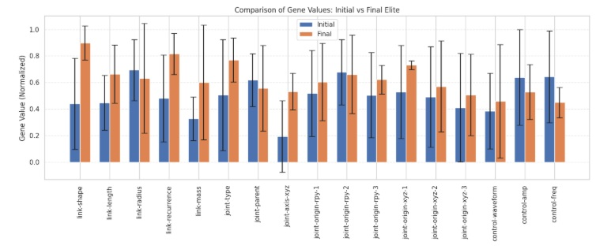

 
This shows that the link length, weight and recurrence increased a lot from the first elite to the last. Most other areas increased in small amounts overall.

## Encoding Scheme Experiments
## ESE - Iteration 1

Following the basic experiments, I decided to make the max size of the items smaller to avoid it using the wall to cheat.

  

When I made them smaller I realised that they lost their form, and because they were so spaced out, they were struggling to move, as one piece’s movement wasn’t really affecting the other pieces, as they were two far away.

  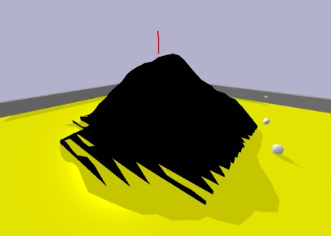

  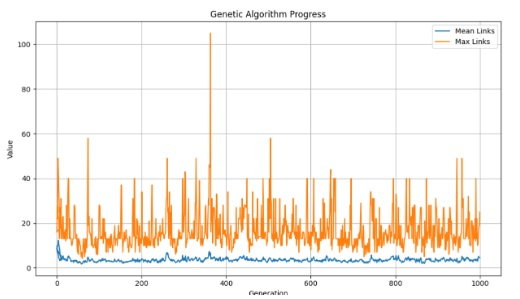

The max links are a lot less in this generation, it seems to be focusing on a lot less complex creatures overall.

  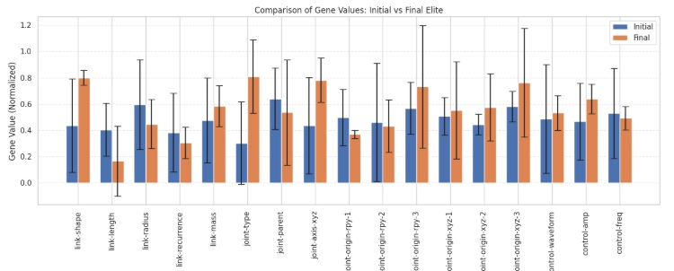

From the initial to the final elite, the link shapes changed a lot, and the way the joints are positioned on the axis also increased.

I therefore altered "joint-origin-xyz-1/2/3" to make them bunch up more. The complexity was also quite minimal in this iteration, so I increased the amount of connections in the next generation. I also made the robot start further away, so it could get a bit of a run-up first before starting the climb. Because of this I also made the run-time of the simulation longer to give the robot a bit more of a chance to move. I don’t know if that helped but it maybe cut out the versions that weren’t moving as much from the outset.

## ESE - Iteration 2

For this iteration, I did a couple of runs to see if the outputs would be different. For the first one I liked the spacing of the links as they looked a bit like hands attached to a body. However I felt like it was now too small to be able to climb such a large mountain, which is why I stopped the experiment fairly early into the process. 

  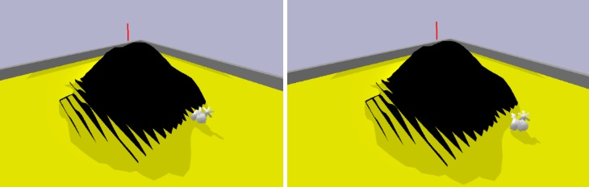

For the second run I got a lot more of a basic a shape come out which was surprising, as it did not seem to have a preference for different shapes, as long as they were able to get to the edge of the mountain:

  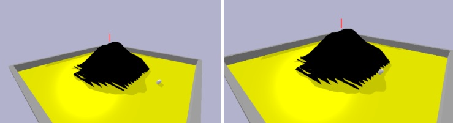

  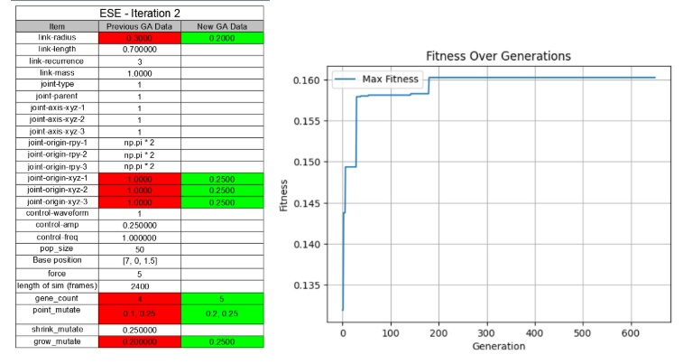

  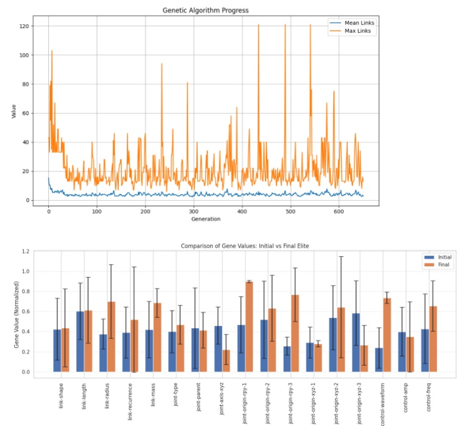

For this graph comparing the initial elite to the final it looked like the joint positions seemed to flip around in their values, and the weight of the links got heavier. The link radius also grew in size overall.

For the next one I increased the size slightly, but kept the amount of links and the spacing the same (scaled up to the size of the robot). I also increased the strength the robot had and the speed of movement. This was "control-amp" and "control-freq". I also moved it to a different part of the arena that didn’t have as harsh an incline to help it improve its climbing ability less dramatically.

## ESE - Iteration 3

  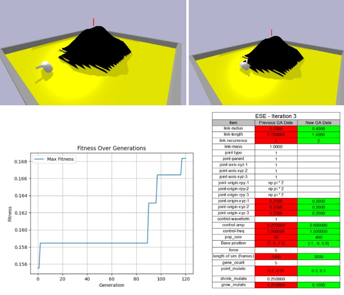

After trying a couple of times, this was making more progress, however it made very simple shapes which were winning with the fitness, using the cylinder to ‘roll’ at the start to make further ground than other models. 
These were fine for the walking part, but were unable to do the climbing part due to being too simple. Even though it was increasing it was getting higher simply because it was able to create large pieces that would ‘hang’ over the first part of the mountain, not because they were climbing it. I stopped the generations fairly early in the process due to this as it felt like they were not learning to climb.

  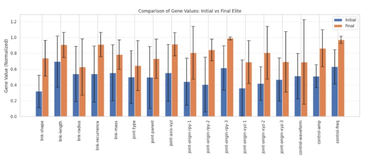

On this graph it shows the increase in all aspects on average from the original elite produced to the final elite produced.

## ESE - Iteration 4

For this iteration I wanted to change a lot of things, as the project seemed to be halting in progress at the base of the mountain. I increased the size of the creature, and increased the strength of movement and made it lighter. 

For the first generation I also wanted to make a larger pool so that the initial creature had a higher chance of choosing a good design to be evolved further down the line. This was at 600 and then it drops down to 200 for subsequent generations

I also added some punishments for the creature if it was too simple, the objects or ‘muscles’ were too small, or if the muscles were too big as well. This can be found in ‘creature.py’ as these variables:
MIN_JOINT_RADIUS
MIN_MUSCLE_LENGTH

MAX_JOINT_RADIUS
MAX_MUSCLE_LENGTH

MIN_JOINT_COUNT
MIN_MUSCLE_COUNT

And these functions: 
check_tiny_parts(self):
check_large_parts(self):
check_too_simple(self):

This was because it felt like with the previous iteration it was using very simple creatures that ‘rolled’ to the edge of the mountain and hung over the edge. This would mean they beat others that could do better in further generations. Also , and the small parts often didn’t add much movement and would get in the way, and the parts that were too large often overbalanced the creature.

I also kept the generation going for longer as I felt like it had more potential to improve than the previous iterations. This worked as it got the creature to move to the mountain edge and bend onto the mountain, which was good progress. 

  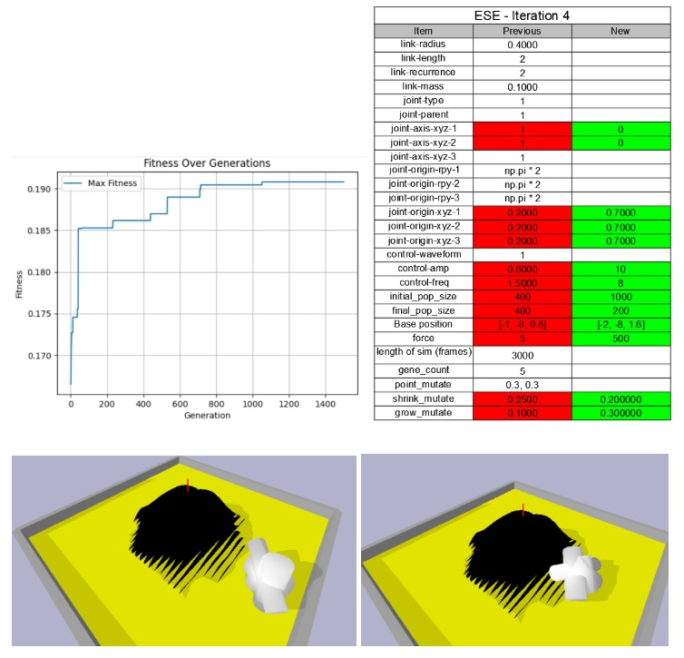

I think that in the next generation I want to make sure that the motors are working correctly, as it still feels like it is only moving in small directions instead of more large and sweeping movements. In this iteration I also made it so that the motors were only moving in the z plane, however I think in the next iteration I will add back in another plane for the motors to move as it almost needs one plane to walk and one plane to climb.

  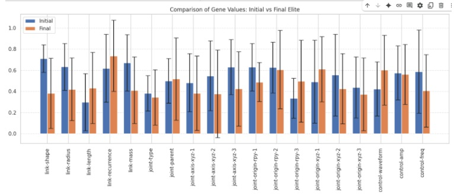

The final joint axis’ and the size of the links were a bit smaller in the final elite run, however for the most part, everything else stayed the same.

## ESE - Iteration 5

  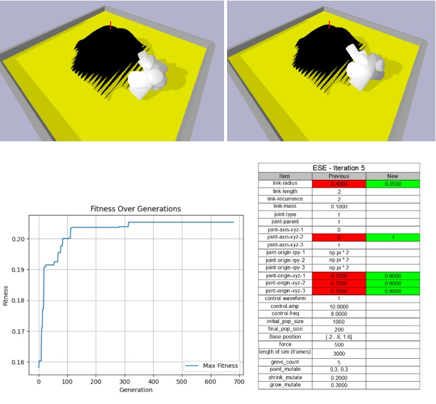

  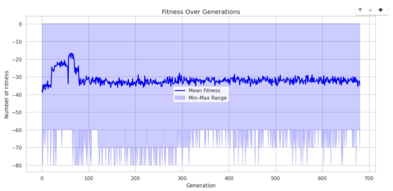

The fitness graph above shows that the average fitness became a lot more steady over time. This could be due to the fact that the changes in max fitness become a lot more minimal.

  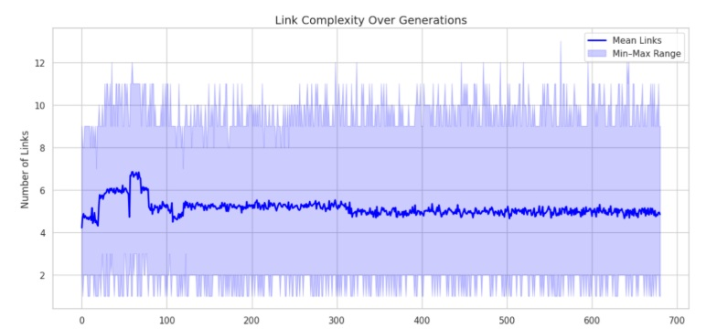

The changes to the design have made the genetic algorithm become quite a lot more ordered in it’s range now, between 0 and 13. This could be due to a specific scenario being focused on due to the penalties that have been included for size/ complexity. The max links only seem to be within 6 links of each other throughout the run.

I think, even though the fitness was higher for this iteration, the previous iteration was comparably better as it had a better climbing motion.

  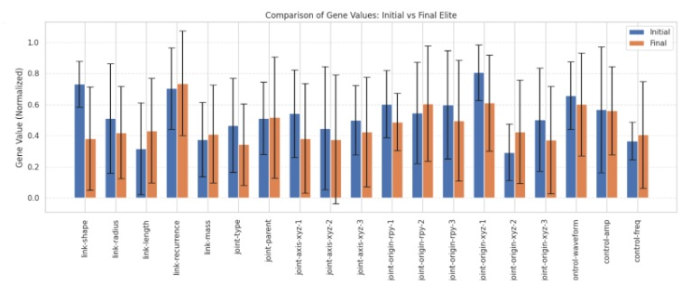

This graph shows how the different gene values have changed (on average) between the initial and final run. It looks like many of the values reduced slightly overall.

## Exceptional Criteria Experiments
## ECE - Iteration 1

For this part I had the idea of creating a small ‘assault course’ for the robot to evolve to go through. I created the design of this in Unity with Probuilder shapes, then exported them as an obj file. It was populated with varying levels, walls and bumpy surfaces with the rings that the robot would need to climb over. The arch was the end point that the robot would need to get to. It still utilised the euclidean distance as a reward scheme.

  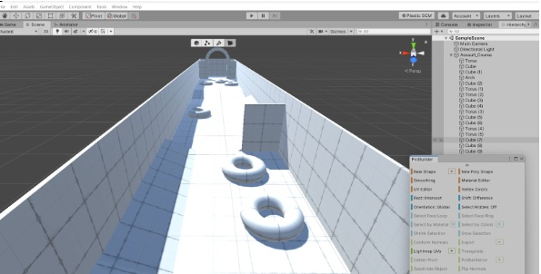

I was able to get almost halfway there with this iteration, however I think due to the uneven ground it was unable to progress further at this time after it rolled over:

  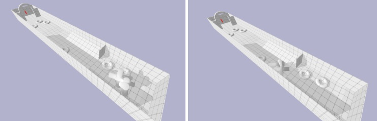

  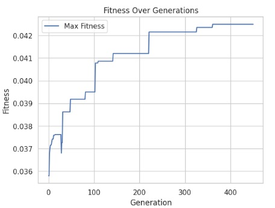

(The small dip is because I changed the position slightly into running the simulation in order to achieve better results.) This was making quite steady progress, so maybe I could have run it for slightly longer, and it may have gone up slightly further before plateauing. 

  

There were not too many changes shown overall on average from the original elite to the final elite, however some of the joint positions have changed quite a lot on average, and its movements were slightly more frequent.
## Evaluation

I am happy with my experiments overall given the restrictions of power in my laptop. I feel like I assessed and experimented with lots of different shapes and sizes to see if they would achieve better results, with some almost developing a climbing ability (ESE - Iteration 4). I think moving forward I would like to experiment more with more ‘animal’ like robots to see if this would aid their climbing ability. I was also thinking that a lot of the results may have been written off because the robot was walking in the wrong direction. Maybe if the creature started in the middle with mountains surrounding him, other elites would arise.
